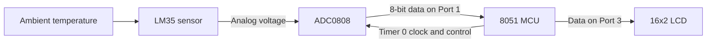

<div align="center">
  
</div>

<p align="center">
  
  
  
  
  
  
  
</p>

## Overview

This project implements a digital thermometer around an **8051-compatible microcontroller**. An **LM35** converts temperature into an analog voltage, an **ADC0808** digitizes that signal, and the microcontroller writes the measured value to a **16x2 character LCD**.

The firmware is written for the Keil C51-style 8051 environment and demonstrates ADC handshaking, timer-generated ADC clocking, 8-bit LCD control, continuous sensor acquisition, and a compact smart-measurement pipeline designed for a resource-constrained MCU.

> **Educational prototype:** this project is not a calibrated medical thermometer and must not be used for clinical decisions.

## System Architecture



## How It Works

1. The LM35 produces a voltage proportional to temperature, nominally **10 mV per °C**.
2. ADC0808 channel 0 is selected by driving `CHA`, `CHB`, and `CHC` low.
3. The 8051 generates the ADC clock by toggling `P2.2` from the Timer 0 interrupt.
4. `ALE` and `START` begin a conversion, while `EOC` indicates when conversion is complete.
5. `OE` enables the ADC output, and the 8-bit result is read through Port 1.
6. Sixteen readings form one measurement window. The minimum and maximum are rejected, and the remaining 14 readings are averaged.
7. The firmware converts the filtered ADC result to Celsius, grades signal quality, and detects temperature direction.
8. Each valid window enters a 16-point history used for the auto-ranging LCD graph and bounded 60-second forecast.

## Smart Measurement Layer

The original project displayed one raw ADC reading. This version adds a distinctive telemetry layer while staying lightweight enough for an 8051:

| Capability | Behaviour |
| --- | --- |
| **Spike rejection** | Removes one minimum and one maximum value from every 16-sample window |
| **Noise reduction** | Averages the remaining 14 readings without storing or sorting an array |
| **Measurement quality** | Reports `HIGH`, `MED`, or `LOW` from the sample spread |
| **Live trend** | Reports `RISING`, `FALLING`, or `STABLE` compared with the previous valid window |
| **Sensor protection** | Replaces the reading with `SENSOR FAULT` when the calculated value exceeds the LM35 operating range |
| **Integer-only conversion** | Avoids floating-point overhead in the embedded firmware |
| **CGRAM thermal sparkline** | Turns LCD row 2 into a scrolling chart using all eight custom HD44780 characters |
| **Sub-degree graph history** | Stores tenths of a degree instead of whole degrees, preserving small changes before auto-ranging |
| **Robust forecast** | Fits a least-squares trend across up to 16 windows instead of amplifying one noisy difference |
| **Bounded prediction** | Projects 15 windows ahead and limits the forecast change to ±20.0 °C |

### 16x2 thermal dashboard

The first LCD row is designed to fit even at the LM35 upper limit. It contains current temperature, forecast, direction, and quality:

```text
26.1C>27.4C^H
```

- `^`, `v`, or `=` means rising, falling, or stable.
- `H`, `M`, or `L` means high, medium, or low measurement quality.

The second row uses CGRAM characters 0 through 7 as vertical bar levels. A flat history is deliberately drawn at mid-height, while a changing history is scaled to its own visible minimum and maximum:

```text
▂▂▃▃▄▄▅▅▅▆▆▇▇▇██
```

The Python model renders the same graph with Unicode blocks; the physical LCD uses custom 5x8-dot characters. No extra display hardware is required.

### Forecast method

The prediction is based on a linear least-squares slope over the visible history—not only the last two measurements. The nominal timing is one window every four seconds, so 15 projected windows represent approximately one minute. The prediction remains integer-only and is clamped to both the LM35 range and a maximum ±20.0 °C change.

## Hardware

| Component | Purpose |
| --- | --- |
| 8051-compatible MCU | Controls acquisition, conversion timing, and display output |
| LM35 | Analog temperature sensor with a nominal 10 mV/°C response |
| ADC0808 | Converts the LM35 analog voltage into an 8-bit digital value |
| 16x2 LCD | Displays the measured temperature |
| 5 V supply and support components | Powers the digital and analog sections |

## Pin Mapping

| Signal | 8051 connection | Function |
| --- | --- | --- |
| ADC data bus | `P1` | Reads the 8-bit conversion result |
| LCD data bus | `P3` | Sends commands and display data |
| `RS`, `RW`, `EN` | `P2.5`, `P2.6`, `P2.7` | LCD control |
| `ALE`, `OE`, `START`, `EOC` | `P2.3`, `P2.4`, `P2.1`, `P2.0` | ADC0808 control and status |
| ADC clock | `P2.2` | Timer 0 generated clock; the same interrupt supplies the measurement-window timebase |
| `CHC`, `CHB`, `CHA` | `P0.7`, `P0.6`, `P0.5` | ADC channel selection |

## Temperature Conversion and Calibration

For an ideal 8-bit ADC:

```text
ADC count N ≈ (LM35 voltage / ADC reference voltage) × 255
Temperature °C ≈ N × ADC reference voltage × 100 / 255
```

The firmware performs this conversion with integer arithmetic. `ADC_VREF_MV` is set to **2560 mV** by default, giving approximately 10 mV per ADC count and therefore close to 1 °C per count with an LM35. Change this constant to the reference voltage measured on the real circuit.

Calibrate the completed circuit against a trusted thermometer before treating its output as an accurate measurement.

## Build and Simulate

### Requirements

- **Keil µVision with the C51 toolchain**, or another compiler supporting `reg51.h`, `sbit`, and the C51 interrupt syntax
- **Proteus Design Suite** for circuit simulation
- An 8051, LM35, ADC0808, and 16x2 LCD circuit matching the pin table above

### Steps

1. Create an 8051 C project in Keil µVision.
2. Add [`DigitalThermometer.c`](./DigitalThermometer.c) to the target.
3. Select the correct 8051-compatible device and enable HEX-file generation.
4. Build the project and load the generated HEX file into the MCU in Proteus.
5. Wire the hardware according to the pin mapping and start the simulation.
6. Confirm that the ADC reference matches `ADC_VREF_MV` in the source.
7. Confirm that `OSCILLATOR_HZ` matches the MCU clock so the forecast horizon remains close to 60 seconds.
8. Adjust the LM35 input temperature and verify the dashboard and scrolling sparkline.

### Run the desktop reference model

The Python file mirrors the embedded measurement algorithm and can be run without 8051 hardware:

```bash
python DigitalThermometer.py
```

It processes example 16-sample windows and prints a two-line LCD preview. It is useful for checking filtering, conversion, quality, trend, auto-ranging, forecasting, and fault logic before changing the embedded firmware.

### Run the reference-model tests

```bash
python -m unittest discover -s tests -v
```

The tests cover spike rejection, quality and trend thresholds, flat and auto-ranged charts, least-squares forecasting, exact 16-column formatting, and fault recovery.

> A Proteus schematic and compiled HEX file are not currently included in this repository.

## Repository Contents

| File | Status |
| --- | --- |
| [`DigitalThermometer.c`](./DigitalThermometer.c) | Primary 8051 firmware with filtering, CGRAM charting, forecasting, quality grading, and fault handling |
| [`DigitalThermometer.py`](./DigitalThermometer.py) | Runnable desktop reference model with a matching Unicode sparkline |
| [`tests/test_thermometer.py`](./tests/test_thermometer.py) | Automated checks for the filtering, chart, forecast, display, and fault logic |

## Recommended Improvements

- Add the Proteus project and a verified circuit schematic
- Store a two-point calibration in external EEPROM
- Add a push-button page for minimum, maximum, and session-average temperature
- Add UART output for long-term temperature logging
- Document the bill of materials, ADC reference, oscillator, and power supply
- Include tested HEX output and photographs of the completed hardware

## Author

**Sreeraj S** — Electronics and Communication Engineer  
[LinkedIn](https://www.linkedin.com/in/sreeraj-santhosh-64a285243/) · [GitHub](https://github.com/SREERAJSANTHOSH)
