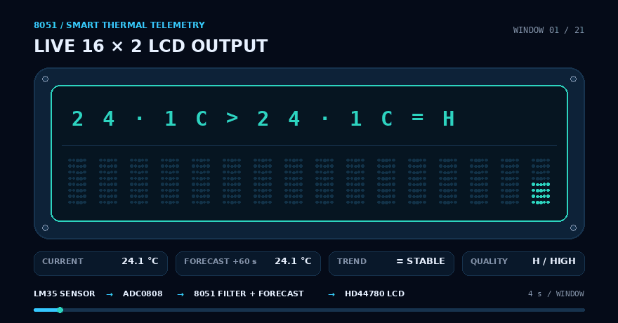
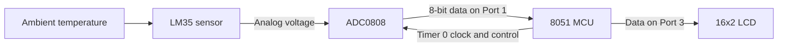

<div align="center">
  
</div>

<p align="center">
  
  
  
  
  
  
  
</p>

## Overview

This project implements a digital thermometer around an **8051-compatible microcontroller**. An **LM35** converts temperature into an analog voltage, an **ADC0808** digitizes that signal, and the microcontroller writes the measured value to a **16x2 character LCD**.

The firmware is written for the Keil C51-style 8051 environment and demonstrates ADC handshaking, timer-generated ADC clocking, 8-bit LCD control, continuous sensor acquisition, and a compact predictive-measurement pipeline designed for a resource-constrained MCU.

> **Educational prototype:** this project is not a calibrated medical thermometer and must not be used for clinical decisions.

## Live Output Demonstration

<p align="center">
  
</p>

<p align="center"><sub>Reference-model visualization of the two-line LCD dashboard. Hardware readings depend on ADC reference, oscillator timing, and calibration.</sub></p>

## System Architecture



## How It Works

1. The LM35 produces a voltage proportional to temperature, nominally **10 mV per °C**.
2. ADC0808 channel 0 is selected by driving `CHA`, `CHB`, and `CHC` low.
3. The 8051 generates an approximately **10.5 kHz** ADC clock by toggling `P2.2` from the Timer 0 interrupt. An 8:1 software prescaler limits expensive 16-bit ISR work while keeping the measurement timebase accurate.
4. `ALE` and `START` begin a conversion, while `EOC` indicates when conversion is complete.
5. `OE` enables the ADC output, and the 8-bit result is read through Port 1.
6. Sixteen readings form one measurement window. The minimum and maximum are rejected, and the remaining 14 readings are averaged.
7. The firmware converts the filtered ADC result to Celsius, grades signal quality, and detects temperature direction.
8. Each valid window enters a 16-point history used for the auto-ranging LCD graph, bounded 60-second forecast, thermal-contact heuristic, and threshold ETA.
9. If the sensor becomes invalid, the last trustworthy slope supplies up to five clearly labelled estimated readings before the display falls back to a hard fault warning.

## Smart Measurement Layer

The original project displayed one raw ADC reading. This version adds a distinctive telemetry layer while staying lightweight enough for an 8051:

| Capability | Behaviour |
| --- | --- |
| **Spike rejection** | Removes one minimum and one maximum value from every 16-sample window |
| **Noise reduction** | Averages the remaining 14 readings without storing or sorting an array |
| **Measurement quality** | Reports `HIGH`, `MED`, or `LOW` from the sample spread |
| **Live trend** | Reports `RISING`, `FALLING`, or `STABLE` compared with the previous valid window |
| **Sensor protection** | Replaces the reading with `SENSOR FAULT` when the calculated value exceeds the LM35 operating range |
| **Integer-only conversion** | Avoids floating-point overhead in the embedded firmware |
| **CGRAM thermal sparkline** | Turns LCD row 2 into a scrolling chart using all eight custom HD44780 characters |
| **Sub-degree graph history** | Stores tenths of a degree instead of whole degrees, preserving small changes before auto-ranging |
| **Robust forecast** | Fits a least-squares trend across up to 16 windows instead of amplifying one noisy difference |
| **Bounded prediction** | Projects 15 windows ahead and limits the forecast change to ±20.0 °C |
| **Time-to-threshold ETA** | Reuses the fitted slope to estimate when the temperature will reach 37.0 °C, rounded conservatively and limited to 99 minutes |
| **Thermal-contact detection** | Marks a rise of at least 1.5 °C across two windows with `!` for a strong live touch demonstration |
| **Fault dead reckoning** | Shows up to five `EST` values from the last valid slope, then switches to the normal sensor-fault warning |
| **Low-cost ISR timebase** | Generates an ADC0808-compatible clock while updating the 16-bit measurement tick only every eighth interrupt |

### 16x2 thermal dashboard

The first LCD row is designed to fit even at the LM35 upper limit. It contains current temperature, forecast, direction, and quality:

```text
26.1C>27.4C^H
```

- `^`, `v`, or `=` means rising, falling, or stable.
- `!` replaces the trend symbol when the two-window rise suggests contact with the LM35.
- `H`, `M`, or `L` means high, medium, or low measurement quality.

The second row uses CGRAM characters 0 through 7 as vertical bar levels. A flat history is deliberately drawn at mid-height, while a changing history is scaled to its own visible minimum and maximum:

```text
▂▂▃▃▄▄▅▅▅▆▆▇▇▇██
```

The Python model renders the same graph with Unicode blocks; the physical LCD uses custom 5x8-dot characters. No extra display hardware is required.

### Predictive and fault display states

| State | LCD row 1 | LCD row 2 |
| --- | --- | --- |
| Dashboard | `26.4C>28.1C^H` | Live 16-window sparkline |
| Likely sensor contact | `27.9C>31.2C!M` | Live 16-window sparkline |
| Threshold ETA | `37.0C IN 02:30` | Live 16-window sparkline |
| Sensor fault with estimate | `SENSOR FAULT` | `EST 26.7C (3)` |
| Estimate budget exhausted | `SENSOR FAULT` | `CHECK LM35/ADC` |

When a usable slope points toward the configurable `ALERT_THRESHOLD_X10`, row 1 alternates between the dashboard and the ETA page. The ETA is rounded up to avoid announcing an earlier crossing than the fitted line predicts.

During an invalid sensor reading, `EST` is explicitly an extrapolation—not a measurement. The number in parentheses is the remaining estimation budget. After five fault windows, or when no trustworthy slope exists, the firmware stops estimating.

### Forecast and ETA method

The prediction is based on a linear least-squares slope over the visible history—not only the last two measurements. The nominal timing is one window every four seconds, so 15 projected windows represent approximately one minute. The forecast, ETA, and dead-reckoned values all use integer-only arithmetic. Forecast change is capped at ±20.0 °C, estimates are clamped to the LM35 range, and ETA is rejected when the slope is flat, points away from the threshold, or exceeds 99 minutes.

Contact detection is intentionally a heuristic for demonstrations, not proof that a person touched the sensor. Rapid environmental heating can produce the same `!` marker.

## Hardware

| Component | Purpose |
| --- | --- |
| 8051-compatible MCU | Controls acquisition, conversion timing, and display output |
| LM35 | Analog temperature sensor with a nominal 10 mV/°C response |
| ADC0808 | Converts the LM35 analog voltage into an 8-bit digital value |
| 16x2 LCD | Displays the measured temperature |
| 5 V supply and support components | Powers the digital and analog sections |

## Pin Mapping

| Signal | 8051 connection | Function |
| --- | --- | --- |
| ADC data bus | `P1` | Reads the 8-bit conversion result |
| LCD data bus | `P3` | Sends commands and display data |
| `RS`, `RW`, `EN` | `P2.5`, `P2.6`, `P2.7` | LCD control |
| `ALE`, `OE`, `START`, `EOC` | `P2.3`, `P2.4`, `P2.1`, `P2.0` | ADC0808 control and status |
| ADC clock | `P2.2` | Timer 0 generated ≈10.5 kHz clock; an 8:1 prescaler supplies the lower-rate measurement tick |
| `CHC`, `CHB`, `CHA` | `P0.7`, `P0.6`, `P0.5` | ADC channel selection |

### Timing note

With the default 11.0592 MHz oscillator and `TIMER0_RELOAD = 0xD4`, the ADC clock is approximately `11.0592 MHz / 12 / 44 / 2 = 10.47 kHz`. That provides margin above the **10 kHz minimum** in the [TI ADC0808-N datasheet](https://www.ti.com/lit/gpn/ADC0808-N). Recalculate the reload and window tick count if the oscillator changes.

The prescaler reduces 16-bit work inside the interrupt, but Timer 0 still services every ADC half-cycle. For physical hardware, inspect the compiler's generated ISR timing; an external ADC clock is preferable if the remaining CPU margin is insufficient.

## Temperature Conversion and Calibration

For an ideal 8-bit ADC:

```text
ADC count N ≈ (LM35 voltage / ADC reference voltage) × 255
Temperature °C ≈ N × ADC reference voltage × 100 / 255
```

The firmware performs this conversion with integer arithmetic. `ADC_VREF_MV` is set to **2560 mV** by default, giving approximately 10 mV per ADC count and therefore close to 1 °C per count with an LM35. Change this constant to the reference voltage measured on the real circuit.

Calibrate the completed circuit against a trusted thermometer before treating its output as an accurate measurement.

## Build and Simulate

### Requirements

- **Keil µVision with the C51 toolchain**, or another compiler supporting `reg51.h`, `sbit`, and the C51 interrupt syntax
- **Proteus Design Suite** for circuit simulation
- An 8051, LM35, ADC0808, and 16x2 LCD circuit matching the pin table above

### Steps

1. Create an 8051 C project in Keil µVision.
2. Add [`DigitalThermometer.c`](./DigitalThermometer.c) to the target.
3. Select the correct 8051-compatible device and enable HEX-file generation.
4. Build the project and load the generated HEX file into the MCU in Proteus.
5. Wire the hardware according to the pin mapping and start the simulation.
6. Confirm that the ADC reference matches `ADC_VREF_MV` in the source.
7. Confirm that `OSCILLATOR_HZ` matches the MCU clock so the forecast horizon remains close to 60 seconds.
8. Adjust the LM35 input temperature and verify the dashboard, ETA page, contact marker, and scrolling sparkline.
9. Drive the ADC input above the configured LM35 range to verify bounded `EST` pages followed by the hard fault screen.

### Run the desktop reference model

The Python file mirrors the embedded measurement algorithm and can be run without 8051 hardware:

```bash
python DigitalThermometer.py
```

It processes example 16-sample windows and prints a two-line LCD preview. It is useful for checking filtering, conversion, quality, trend, auto-ranging, forecasting, ETA, contact detection, fault estimation, and recovery before changing the embedded firmware.

### Run the reference-model tests

```bash
python -m unittest discover -s tests -v
```

The 28 tests cover spike rejection, quality and trend thresholds, chart scaling, least-squares fitting, conservative ETA rounding, contact boundaries, bounded dead reckoning, page alternation, exact 16-column formatting, and fault recovery.

> A Proteus schematic and compiled HEX file are not currently included in this repository.

## Repository Contents

| File | Status |
| --- | --- |
| [`DigitalThermometer.c`](./DigitalThermometer.c) | Primary 8051 firmware with filtered acquisition, CGRAM charting, ETA, contact detection, and fault estimation |
| [`DigitalThermometer.py`](./DigitalThermometer.py) | Runnable parity model for every measurement and display state |
| [`tests/test_thermometer.py`](./tests/test_thermometer.py) | Automated checks for filtering, charts, forecasts, ETA, contact, display pages, and fault recovery |
| [`assets/digital-thermometer-demo.gif`](./assets/digital-thermometer-demo.gif) | Animated reference output of the 16x2 LCD dashboard |

## Recommended Improvements

- Add the Proteus project and a verified circuit schematic
- Store a two-point calibration in external EEPROM
- Add push buttons for threshold configuration, minimum, maximum, and session-average pages
- Move the ADC clock to a hardware or external source if measured ISR load is excessive
- Add UART output for long-term temperature logging
- Document the bill of materials, ADC reference, oscillator, and power supply
- Include tested HEX output and photographs of the completed hardware

## Author

**Sreeraj S** — Electronics and Communication Engineer  
[LinkedIn](https://www.linkedin.com/in/sreeraj-santhosh-64a285243/) · [GitHub](https://github.com/SREERAJSANTHOSH)
