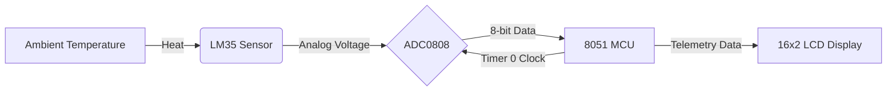

<div align="center">
  
</div>

<p align="center">
  <a href="https://github.com/SREERAJSANTHOSH/Digital_Thermometer/actions/workflows/ci.yml">
    
  </a>
  
  
  
  
</p>

## Overview

A professional, robust digital thermometer built around an **8051-compatible microcontroller**. The system uses an **LM35** to convert temperature into an analog voltage, an **ADC0808** to digitize that signal, and the MCU to drive a smart **16x2 character LCD telemetry dashboard**.

The firmware (written in Keil C51) implements a predictive-measurement pipeline designed for resource-constrained MCUs, providing features usually reserved for higher-end systems, such as live trend forecasting and an auto-ranging sparkline.

> **Educational Prototype:** This project is not a calibrated medical thermometer and must not be used for clinical decisions.

---

## Live Output Demonstration

<p align="center">
  
</p>
<p align="center"><sub>Reference-model visualization of the two-line LCD dashboard. Hardware readings depend on ADC reference, oscillator timing, and calibration.</sub></p>

---

## ✨ Features

- **Smart Filtering**: Rejects min/max spikes in a 16-sample window and averages the rest for noise reduction.
- **Live Trend Forecasting**: Uses a least-squares trend across history to forecast 60 seconds into the future.
- **Time-to-Threshold ETA**: Estimates the time required to reach a specific alert threshold.
- **CGRAM Thermal Sparkline**: Transforms LCD row 2 into a scrolling auto-ranged graph using custom HD44780 characters.
- **Signal Quality Grading**: Classifies measurement variance into `HIGH`, `MED`, or `LOW` quality.
- **Thermal-Contact Detection**: Heuristically detects physical contact via rapid temperature rises (`!`).
- **Fault Tolerance**: Provides dead-reckoning estimations during short sensor dropouts before triggering a hard fault warning.
- **Integer-Only Pipeline**: Eliminates floating-point overhead to run smoothly on an 8-bit MCU.
- **Python Reference Model**: Includes a parity implementation in Python (`src/DigitalThermometer.py`) with a full 28-test suite.

---

## 🚀 Quick Start (Python Reference Model)

You can explore the system's logic on your desktop using the Python reference model.

```bash
# 1. Clone the repository
git clone https://github.com/SREERAJSANTHOSH/Digital_Thermometer.git
cd Digital_Thermometer

# 2. Set up a virtual environment and install dev dependencies
python -m venv .venv
source .venv/bin/activate
pip install -e ".[dev]"

# 3. Run the reference model demonstration
python src/DigitalThermometer.py
```

---

## 🏗️ System Architecture



---

## 🔧 Hardware Setup

For full circuit diagrams, BOM (Bill of Materials), pin mapping, and calibration instructions, please see the [**Hardware Documentation**](docs/HARDWARE.md). 

Brief MCU Pin Mapping:
- **P0.5 – P0.7**: ADC Channel Select
- **P1.0 – P1.7**: ADC 8-bit Data Bus
- **P2.0 – P2.4**: ADC Control & Clock (Timer 0)
- **P2.5 – P2.7**: LCD Control (RS, RW, EN)
- **P3.0 – P3.7**: LCD Data Bus

---

## ⚙️ Configuration Reference

Key constants are defined in `firmware/DigitalThermometer.c`. Adjust these to match your hardware and use-case:

| Constant | Default | Description |
|----------|---------|-------------|
| `ADC_VREF_MV` | 2560 | ADC reference voltage in millivolts |
| `OSCILLATOR_HZ` | 11059200 | MCU crystal frequency |
| `TIMER0_RELOAD` | 0xD4 | Timer 0 reload value for ADC clock |
| `ALERT_THRESHOLD_X10` | 370 | Alert threshold in tenths °C (e.g., 37.0 °C) |
| `CONTACT_RISE_X10` | 15 | Temperature rise over 2 windows indicating contact |

For detailed firmware internals, check the [**Firmware Documentation**](docs/FIRMWARE.md).

---

## 🧪 Testing

The repository includes a comprehensive 28-test suite validating the Python reference model. The tests ensure that filtering, forecasting, thresholds, and fault handling operate perfectly.

```bash
# Run the test suite using pytest
python -m pytest tests/ -v
```

---

## 📁 Project Structure

```text
Digital_Thermometer/
├── .github/                 # CI/CD and Issue Templates
├── assets/                  # Demo media and images
├── docs/                    # Technical documentation
│   ├── FIRMWARE.md          # 8051 code architecture
│   ├── HARDWARE.md          # Circuit & BOM instructions
│   └── PYTHON_MODEL.md      # Reference model docs
├── firmware/
│   └── DigitalThermometer.c # 8051 embedded firmware (Keil C51)
├── src/
│   └── DigitalThermometer.py# Python reference model
├── tests/
│   └── test_thermometer.py  # Test suite for the reference model
├── CHANGELOG.md             # Project release history
├── CONTRIBUTING.md          # Guidelines for contributing
├── LICENSE                  # MIT License
└── pyproject.toml           # Python packaging and linting config
```

---

## 🤝 Contributing

Contributions are welcome! Please see [CONTRIBUTING.md](CONTRIBUTING.md) for details on how to set up the dev environment, format your code, and submit Pull Requests.

---

## 📜 License

This project is licensed under the [MIT License](LICENSE).

---

## 👨‍💻 Author

**Sreeraj S** — Electronics and Communication Engineer  
[LinkedIn](https://www.linkedin.com/in/sreeraj-santhosh-64a285243/) · [GitHub](https://github.com/SREERAJSANTHOSH)
